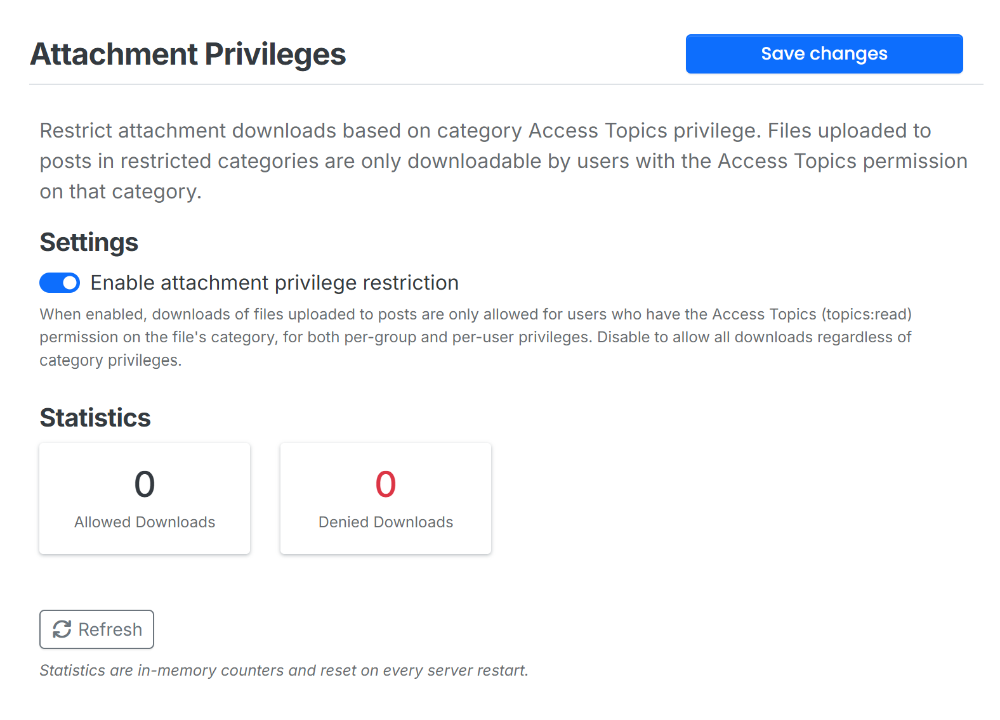

# Nodebb Attachment Privileges plugin

Restrict attachment downloads based on category Access Topics privilege and chat room membership

- The attachment will only be visible to users with the `Access Topics` privilege in the category where the topic is located.
- Chat (PM/room) attachments are only visible to room participants; public rooms follow core chat room visibility rules (chat privilege, allowed groups, admins). Guests are never allowed.
- Only the uploader of a file, an admin, or a user who already has access to it can bind it to a chat room. Files with no usage anywhere remain publicly accessible.
- The uploader never loses fetch access to their own uploads (mirrors core's upload ownership model).
- Attachments whose chat rooms have all been deleted are denied (fail-closed) rather than becoming public.
- Association writes are durable: failed writes are queued for retry, and a boot-time catch-up (plus an hourly drain on the job-runner instance) heals anything lost to DB errors or a crash in the fire-and-forget window. No historical backfill — only messages sent after the mechanism is installed are tracked.
- Auto add Cache-Control headers to attachments to prevent caching by browsers and CDNs.

